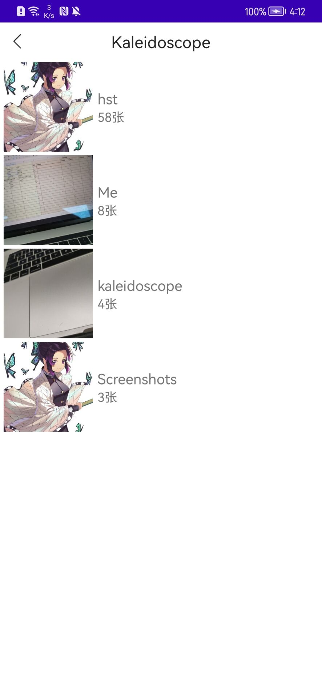
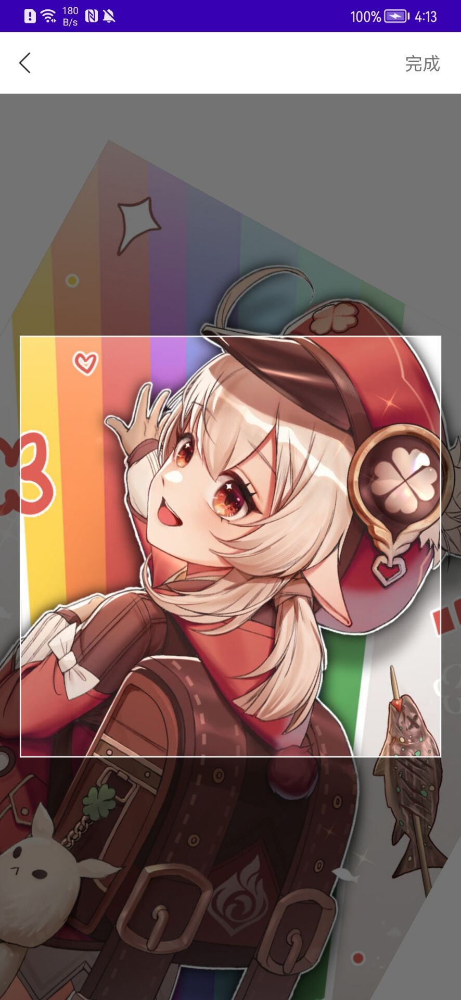

# Kaleidoscope
一个适配了高版本和低版本的相册，带拍照。因为相册每个项目UI和逻辑都可能不一样，所以这里不打成依赖包，请通过下载源码方式放到自己项目中进行对应的修改。

## 用法
1. 打开相册选择图片

```kotlin
Kaleidoscope.from(this).jump { path ->
    Log.i("TEST", "图片绝对路径 = " + path)
}
```

2. 打开相机拍照

```kotlin
Kaleidoscope.from(this).jumpToCamera { path ->
   Log.i("TEST", "图片绝对路径 = " + path)
}
```

更多 API 和用法请参考代码。

### Demo 部份 UI:






代码参考 https://github.com/LuckSiege/PictureSelector，并已踩坑。
